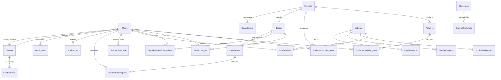

# School Hub - PostgreSQL Database Schema

**Generated:** 2025-12-05  
**Target Database:** PostgreSQL 14+  
**Backend Architecture:** CQRS + Clean Architecture + Vertical Slicing  
**Target Audience:** 800 Students, ~40 Teachers, Admin Staff

---

## 📋 Table of Contents

- [Architecture Overview](#architecture-overview)
- [Database Tables](#database-tables)
- [Entity Relationships](#entity-relationships)
- [Indexes & Performance](#indexes--performance)
- [Time Estimation](#time-estimation)

---

## Architecture Overview

### Backend Stack Recommendation

- **Framework:** .NET 8 / ASP.NET Core
- **ORM:** Entity Framework Core 8
- **Architecture:** Clean Architecture with CQRS
- **CQRS Implementation:** MediatR (Application Layer)
- **API Structure:** Vertical Slicing by Feature
- **Database:** PostgreSQL 14+

### Layer Structure

```
SchoolHub.API/                    (Presentation - Vertical Slices)
├── Features/
│   ├── Auth/
│   │   ├── Endpoints/
│   │   │   ├── Endpoint.cs
│   │   │   ├── Request.cs
│   │   │   └── Response.cs
│   ├── Students/
│   │   ├── Endpoints/
│   │   │   ├── Endpoint.cs
│   │   │   ├── Request.cs
│   │   │   └── Response.cs
│   ├── Teachers/
│   │   ├── Endpoints/
│   │   │   ├── Endpoint.cs
│   │   │   ├── Request.cs
│   │   │   └── Response.cs
│   ├── Admin/
│   │   ├── Endpoints/
│   │   │   ├── Endpoint.cs
│   │   │   ├── Request.cs
│   │   │   └── Response.cs
│   └── Portfolios/
│       ├── Endpoints/
│       │   ├── Endpoint.cs
│       │   ├── Request.cs
│       │   └── Response.cs
│
SchoolHub.Application/            (CQRS - Commands & Queries - Vertical Slices)
├── Features/
SchoolHub.Application/            (CQRS - Commands & Queries - Vertical Slices)
├── Features/
│   ├── Auth/
│   │   ├── Commands/
│   │   ├── Queries/
│   │   └── DTOs/
│   ├── Students/
│   │   ├── Commands/
│   │   ├── Queries/
│   │   └── DTOs/
│   ├── Teachers/
│   │   ├── Commands/
│   │   ├── Queries/
│   │   └── DTOs/
│   ├── Admin/
│   │   ├── Commands/
│   │   ├── Queries/
│   │   └── DTOs/
│   └── Portfolios/
│       ├── Commands/
│       ├── Queries/
│       └── DTOs/
SchoolHub.Domain/                 (Entities & Business Logic)
├── Entities/
├── ValueObjects/
└── Events/
│
SchoolHub.Infrastructure/         (Data Access)
├── Persistence/
├── Repositories/
└── Configurations/
```

---

## Database Tables

### 1. User Management

#### `Users`

**Purpose:** Core user authentication and profile data

| Column         | Type         | Constraints             | Description                                 |
| -------------- | ------------ | ----------------------- | ------------------------------------------- |
| `Id`           | UUID         | PRIMARY KEY             | Unique user identifier                      |
| `Name`         | VARCHAR(200) | NOT NULL                | Full name                                   |
| `UserName`     | VARCHAR(100) | NOT NULL, UNIQUE        | Login username                              |
| `Email`        | VARCHAR(255) | NOT NULL, UNIQUE        | Email address                               |
| `PasswordHash` | VARCHAR(500) | NOT NULL                | Hashed password                             |
| `PhoneNumber`  | VARCHAR(20)  | NULL                    | Contact number                              |
| `Role`         | INTEGER      | NOT NULL                | FK to Roles (Student=1, Teacher=2, Admin=3) |
| `IsActive`     | BOOLEAN      | DEFAULT TRUE            | Account status                              |
| `Avatar`       | TEXT         | NULL                    | Profile picture URL                         |
| `ClassId`      | UUID         | NULL                    | FK to Classes (for students)                |
| `LastLogin`    | TIMESTAMP    | NULL                    | Last login datetime                         |
| `CreatedAt`    | TIMESTAMP    | NOT NULL, DEFAULT NOW() | Account creation                            |
| `UpdatedAt`    | TIMESTAMP    | NOT NULL, DEFAULT NOW() | Last update                                 |

**Indexes:**

- `idx_users_email` on `Email`
- `idx_users_username` on `UserName`
- `idx_users_role` on `Role`
- `idx_users_class` on `ClassId`

---

#### `Classes`

**Purpose:** Student class/grade organization

| Column         | Type        | Constraints             | Description                    |
| -------------- | ----------- | ----------------------- | ------------------------------ |
| `Id`           | UUID        | PRIMARY KEY             | Class identifier               |
| `Name`         | VARCHAR(50) | NOT NULL                | Class name (e.g., "6A", "7B")  |
| `Grade`        | INTEGER     | NOT NULL                | Grade level (6 or 7)           |
| `TeacherId`    | UUID        | NULL                    | FK to Users (homeroom teacher) |
| `StudentCount` | INTEGER     | DEFAULT 0               | Cached student count           |
| `CreatedAt`    | TIMESTAMP   | NOT NULL, DEFAULT NOW() | Creation date                  |

**Indexes:**

- `idx_classes_grade` on `Grade`
- `idx_classes_teacher` on `TeacherId`

---

### 2. Digital Citizenship Missions

#### `Missions`

**Purpose:** 8 Digital Citizenship missions configuration

| Column             | Type         | Constraints             | Description                 |
| ------------------ | ------------ | ----------------------- | --------------------------- |
| `Id`               | UUID         | PRIMARY KEY             | Mission identifier          |
| `Number`           | INTEGER      | NOT NULL, UNIQUE        | Mission number (1-8)        |
| `Title`            | VARCHAR(200) | NOT NULL                | Mission title               |
| `Description`      | TEXT         | NULL                    | Mission description         |
| `Icon`             | VARCHAR(50)  | NULL                    | Icon/emoji                  |
| `EstimatedMinutes` | INTEGER      | DEFAULT 30              | Estimated completion time   |
| `BadgeId`          | UUID         | NOT NULL                | FK to Badges (earned badge) |
| `Order`            | INTEGER      | NOT NULL                | Display order               |
| `IsEnabled`        | BOOLEAN      | DEFAULT TRUE            | Active status               |
| `CreatedAt`        | TIMESTAMP    | NOT NULL, DEFAULT NOW() | Creation date               |
| `UpdatedAt`        | TIMESTAMP    | NOT NULL, DEFAULT NOW() | Last update                 |

**Indexes:**

- `idx_missions_order` on `Order`
- `idx_missions_number` on `Number`

**Static Data (8 Missions):**

1. Digital Citizenship Foundations → Digital Citizen Badge
2. Your Digital Footprint → Footprint Tracker Badge
3. Online Safety & Privacy → Safety Shield Badge
4. Cyberbullying Prevention → Kindness Champion Badge
5. Media Literacy & Fake News → Truth Seeker Badge
6. Digital Communication → Communication Pro Badge
7. Balanced Technology Use → Balance Master Badge
8. Digital Rights & Responsibilities → Digital Leader Badge

---

#### `Activities`

**Purpose:** Individual activities within missions

| Column             | Type         | Constraints             | Description                                   |
| ------------------ | ------------ | ----------------------- | --------------------------------------------- |
| `Id`               | UUID         | PRIMARY KEY             | Activity identifier                           |
| `MissionId`        | UUID         | NOT NULL                | FK to Missions                                |
| `Number`           | INTEGER      | NOT NULL                | Activity number within mission                |
| `Title`            | VARCHAR(200) | NOT NULL                | Activity title                                |
| `Type`             | VARCHAR(50)  | NOT NULL                | 'OneNote', 'Video', 'Game', 'Reading', 'Quiz' |
| `ContentUrl`       | TEXT         | NULL                    | Embedded content URL                          |
| `EstimatedMinutes` | INTEGER      | DEFAULT 10              | Estimated time                                |
| `Instructions`     | TEXT         | NULL                    | Activity instructions                         |
| `Order`            | INTEGER      | NOT NULL                | Display order                                 |
| `IsRequired`       | BOOLEAN      | DEFAULT TRUE            | Required for completion                       |
| `CreatedAt`        | TIMESTAMP    | NOT NULL, DEFAULT NOW() | Creation date                                 |
| `UpdatedAt`        | TIMESTAMP    | NOT NULL, DEFAULT NOW() | Last update                                   |

**Indexes:**

- `idx_activities_mission` on `MissionId`
- `idx_activities_order` on `MissionId, Order`

---

#### `StudentMissionProgress`

**Purpose:** Track student progress on missions

| Column                | Type         | Constraints             | Description                             |
| --------------------- | ------------ | ----------------------- | --------------------------------------- |
| `Id`                  | UUID         | PRIMARY KEY             | Progress identifier                     |
| `StudentId`           | UUID         | NOT NULL                | FK to Users                             |
| `MissionId`           | UUID         | NOT NULL                | FK to Missions                          |
| `Status`              | VARCHAR(50)  | NOT NULL                | 'NotStarted', 'InProgress', 'Completed' |
| `CompletedActivities` | INTEGER      | DEFAULT 0               | Count of completed activities           |
| `TotalActivities`     | INTEGER      | NOT NULL                | Total activities in mission             |
| `ProgressPercentage`  | DECIMAL(5,2) | DEFAULT 0.00            | Calculated percentage                   |
| `StartedAt`           | TIMESTAMP    | NULL                    | When started                            |
| `CompletedAt`         | TIMESTAMP    | NULL                    | When completed                          |
| `UpdatedAt`           | TIMESTAMP    | NOT NULL, DEFAULT NOW() | Last update                             |

**Unique Constraint:** `(StudentId, MissionId)`

**Indexes:**

- `idx_student_mission_progress_student` on `StudentId`
- `idx_student_mission_progress_status` on `Status`

---

#### `StudentActivityProgress`

**Purpose:** Track individual activity completion

| Column        | Type      | Constraints             | Description              |
| ------------- | --------- | ----------------------- | ------------------------ |
| `Id`          | UUID      | PRIMARY KEY             | Progress identifier      |
| `StudentId`   | UUID      | NOT NULL                | FK to Users              |
| `ActivityId`  | UUID      | NOT NULL                | FK to Activities         |
| `IsCompleted` | BOOLEAN   | DEFAULT FALSE           | Completion status        |
| `CompletedAt` | TIMESTAMP | NULL                    | Completion datetime      |
| `Notes`       | TEXT      | NULL                    | Student notes/reflection |
| `CreatedAt`   | TIMESTAMP | NOT NULL, DEFAULT NOW() | First access             |
| `UpdatedAt`   | TIMESTAMP | NOT NULL, DEFAULT NOW() | Last update              |

**Unique Constraint:** `(StudentId, ActivityId)`

**Indexes:**

- `idx_activity_progress_student` on `StudentId`
- `idx_activity_progress_activity` on `ActivityId`

---

### 3. Badges & Gamification

#### `Badges`

**Purpose:** Badge definitions (Student + Teacher CPD badges)

| Column        | Type         | Constraints             | Description                                           |
| ------------- | ------------ | ----------------------- | ----------------------------------------------------- |
| `Id`          | UUID         | PRIMARY KEY             | Badge identifier                                      |
| `Name`        | VARCHAR(200) | NOT NULL                | Badge name                                            |
| `Description` | TEXT         | NULL                    | Badge description                                     |
| `Icon`        | VARCHAR(100) | NULL                    | Icon/emoji                                            |
| `Color`       | VARCHAR(50)  | NULL                    | Badge color (hex)                                     |
| `Category`    | VARCHAR(100) | NOT NULL                | 'DigitalCitizenship', 'AITools', 'Microsoft365', etc. |
| `TargetRole`  | INTEGER      | NOT NULL                | 1=Student, 2=Teacher, 3=Both                          |
| `CpdHours`    | DECIMAL(4,2) | NULL                    | CPD hours (for teachers)                              |
| `IsActive`    | BOOLEAN      | DEFAULT TRUE            | Active status                                         |
| `CreatedAt`   | TIMESTAMP    | NOT NULL, DEFAULT NOW() | Creation date                                         |

**Indexes:**

- `idx_badges_category` on `Category`
- `idx_badges_target_role` on `TargetRole`

---

#### `StudentBadges`

**Purpose:** Student badge awards

| Column        | Type      | Constraints             | Description                      |
| ------------- | --------- | ----------------------- | -------------------------------- |
| `Id`          | UUID      | PRIMARY KEY             | Award identifier                 |
| `StudentId`   | UUID      | NOT NULL                | FK to Users                      |
| `BadgeId`     | UUID      | NOT NULL                | FK to Badges                     |
| `EarnedDate`  | TIMESTAMP | NOT NULL, DEFAULT NOW() | When earned                      |
| `MissionId`   | UUID      | NULL                    | FK to Missions (if from mission) |
| `AutoAwarded` | BOOLEAN   | DEFAULT TRUE            | Auto vs manual award             |

**Unique Constraint:** `(StudentId, BadgeId)`

**Indexes:**

- `idx_student_badges_student` on `StudentId`
- `idx_student_badges_earned_date` on `EarnedDate`

---

#### `TeacherBadgeSubmissions`

**Purpose:** Teacher CPD badge submissions for review

| Column            | Type         | Constraints             | Description                            |
| ----------------- | ------------ | ----------------------- | -------------------------------------- |
| `Id`              | UUID         | PRIMARY KEY             | Submission identifier                  |
| `TeacherId`       | UUID         | NOT NULL                | FK to Users                            |
| `BadgeId`         | UUID         | NOT NULL                | FK to Badges                           |
| `EvidenceLink`    | TEXT         | NOT NULL                | Link to evidence (OneNote, video, etc) |
| `SubmitterNotes`  | TEXT         | NULL                    | Teacher's notes                        |
| `SubmittedAt`     | TIMESTAMP    | NOT NULL, DEFAULT NOW() | Submission datetime                    |
| `Status`          | VARCHAR(50)  | NOT NULL                | 'Pending', 'Approved', 'Rejected'      |
| `ReviewedBy`      | UUID         | NULL                    | FK to Users (admin)                    |
| `ReviewedAt`      | TIMESTAMP    | NULL                    | Review datetime                        |
| `ReviewNotes`     | TEXT         | NULL                    | Admin feedback                         |
| `CpdHoursAwarded` | DECIMAL(4,2) | NULL                    | Awarded CPD hours                      |

**Indexes:**

- `idx_badge_submissions_teacher` on `TeacherId`
- `idx_badge_submissions_status` on `Status`
- `idx_badge_submissions_submitted` on `SubmittedAt`

---

#### `StudentLevels`

**Purpose:** Student level/progression tracking

| Column                | Type         | Constraints     | Description                                       |
| --------------------- | ------------ | --------------- | ------------------------------------------------- |
| `Id`                  | UUID         | PRIMARY KEY     | Level identifier                                  |
| `StudentId`           | UUID         | NOT NULL UNIQUE | FK to Users                                       |
| `CurrentLevel`        | INTEGER      | DEFAULT 1       | Level (1-4)                                       |
| `LevelName`           | VARCHAR(100) | NULL            | 'Digital Scout', 'Explorer', 'Champion', 'Leader' |
| `BadgesEarned`        | INTEGER      | DEFAULT 0       | Total badges earned                               |
| `NextLevelBadgeCount` | INTEGER      | NULL            | Badges needed for next level                      |
| `LevelIcon`           | VARCHAR(100) | NULL            | Level badge icon                                  |
| `LastLevelUpDate`     | TIMESTAMP    | NULL            | Last level-up datetime                            |

**Indexes:**

- `idx_student_levels_student` on `StudentId`
- `idx_student_levels_current_level` on `CurrentLevel`

---

### 4. Portfolio System

#### `Subjects`

**Purpose:** Subject/course definitions

| Column      | Type         | Constraints             | Description         |
| ----------- | ------------ | ----------------------- | ------------------- |
| `Id`        | UUID         | PRIMARY KEY             | Subject identifier  |
| `Name`      | VARCHAR(200) | NOT NULL                | Subject name        |
| `Icon`      | VARCHAR(100) | NULL                    | Subject icon        |
| `Color`     | VARCHAR(50)  | NULL                    | Display color (hex) |
| `IsActive`  | BOOLEAN      | DEFAULT TRUE            | Active status       |
| `CreatedAt` | TIMESTAMP    | NOT NULL, DEFAULT NOW() | Creation date       |

**Examples:** Math, Science, Arabic, English, Islamic Studies, Art, PE

---

#### `PortfolioFiles`

**Purpose:** Student portfolio file uploads

| Column         | Type         | Constraints             | Description                                |
| -------------- | ------------ | ----------------------- | ------------------------------------------ |
| `Id`           | UUID         | PRIMARY KEY             | File identifier                            |
| `StudentId`    | UUID         | NOT NULL                | FK to Users                                |
| `SubjectId`    | UUID         | NOT NULL                | FK to Subjects                             |
| `FileName`     | VARCHAR(500) | NOT NULL                | Original filename                          |
| `FileType`     | VARCHAR(50)  | NOT NULL                | 'pdf', 'docx', 'pptx', 'jpg', 'png', 'mp4' |
| `FileSize`     | BIGINT       | NOT NULL                | File size in bytes                         |
| `StoragePath`  | TEXT         | NOT NULL                | Cloud storage path/URL                     |
| `ThumbnailUrl` | TEXT         | NULL                    | Thumbnail preview URL                      |
| `PreviewUrl`   | TEXT         | NULL                    | Preview URL                                |
| `DownloadUrl`  | TEXT         | NOT NULL                | Download URL                               |
| `UploadedAt`   | TIMESTAMP    | NOT NULL, DEFAULT NOW() | Upload datetime                            |
| `UpdatedAt`    | TIMESTAMP    | NOT NULL, DEFAULT NOW() | Last update                                |

**Indexes:**

- `idx_portfolio_files_student` on `StudentId`
- `idx_portfolio_files_subject` on `SubjectId`
- `idx_portfolio_files_uploaded` on `UploadedAt`

---

#### `PortfolioReflections`

**Purpose:** Student reflections (rich text)

| Column        | Type      | Constraints             | Description                        |
| ------------- | --------- | ----------------------- | ---------------------------------- |
| `Id`          | UUID      | PRIMARY KEY             | Reflection identifier              |
| `StudentId`   | UUID      | NOT NULL                | FK to Users                        |
| `SubjectId`   | UUID      | NOT NULL                | FK to Subjects                     |
| `Content`     | TEXT      | NOT NULL                | HTML content from rich text editor |
| `Prompt`      | TEXT      | NULL                    | Reflection prompt/question         |
| `IsAutoSaved` | BOOLEAN   | DEFAULT FALSE           | Auto-save vs manual save           |
| `CreatedAt`   | TIMESTAMP | NOT NULL, DEFAULT NOW() | Creation datetime                  |
| `UpdatedAt`   | TIMESTAMP | NOT NULL, DEFAULT NOW() | Last update                        |

**Indexes:**

- `idx_portfolio_reflections_student` on `StudentId`
- `idx_portfolio_reflections_subject` on `SubjectId`

---

#### `TeacherFeedback`

**Purpose:** Teacher feedback on student work

| Column      | Type        | Constraints             | Description                     |
| ----------- | ----------- | ----------------------- | ------------------------------- |
| `Id`        | UUID        | PRIMARY KEY             | Feedback identifier             |
| `StudentId` | UUID        | NOT NULL                | FK to Users (student)           |
| `TeacherId` | UUID        | NOT NULL                | FK to Users (teacher)           |
| `SubjectId` | UUID        | NULL                    | FK to Subjects                  |
| `FileId`    | UUID        | NULL                    | FK to PortfolioFiles (optional) |
| `Comment`   | TEXT        | NOT NULL                | Feedback comment                |
| `Type`      | VARCHAR(50) | NOT NULL                | 'Comment', 'RevisionRequest'    |
| `CreatedAt` | TIMESTAMP   | NOT NULL, DEFAULT NOW() | Feedback datetime               |

**Indexes:**

- `idx_feedback_student` on `StudentId`
- `idx_feedback_teacher` on `TeacherId`
- `idx_feedback_created` on `CreatedAt`

---

#### `PortfolioLikes`

**Purpose:** Teacher likes on student portfolios

| Column      | Type      | Constraints             | Description           |
| ----------- | --------- | ----------------------- | --------------------- |
| `Id`        | UUID      | PRIMARY KEY             | Like identifier       |
| `TeacherId` | UUID      | NOT NULL                | FK to Users (teacher) |
| `StudentId` | UUID      | NOT NULL                | FK to Users (student) |
| `SubjectId` | UUID      | NULL                    | FK to Subjects        |
| `CreatedAt` | TIMESTAMP | NOT NULL, DEFAULT NOW() | Like datetime         |

**Unique Constraint:** `(TeacherId, StudentId, SubjectId)`

**Indexes:**

- `idx_portfolio_likes_student` on `StudentId`
- `idx_portfolio_likes_teacher` on `TeacherId`

---

#### `PortfolioStatus`

**Purpose:** Track portfolio review status

| Column           | Type        | Constraints             | Description                            |
| ---------------- | ----------- | ----------------------- | -------------------------------------- |
| `Id`             | UUID        | PRIMARY KEY             | Status identifier                      |
| `StudentId`      | UUID        | NOT NULL                | FK to Users                            |
| `SubjectId`      | UUID        | NOT NULL                | FK to Subjects                         |
| `Status`         | VARCHAR(50) | NOT NULL                | 'Pending', 'Reviewed', 'NeedsRevision' |
| `LastReviewedBy` | UUID        | NULL                    | FK to Users (teacher)                  |
| `LastReviewedAt` | TIMESTAMP   | NULL                    | Last review datetime                   |
| `UpdatedAt`      | TIMESTAMP   | NOT NULL, DEFAULT NOW() | Last update                            |

**Unique Constraint:** `(StudentId, SubjectId)`

**Indexes:**

- `idx_portfolio_status_student` on `StudentId`
- `idx_portfolio_status_status` on `Status`

---

### 5. Teacher CPD (Continuous Professional Development)

#### `CpdModules`

**Purpose:** CPD training modules for teachers

| Column            | Type         | Constraints             | Description                           |
| ----------------- | ------------ | ----------------------- | ------------------------------------- |
| `Id`              | UUID         | PRIMARY KEY             | Module identifier                     |
| `Title`           | VARCHAR(300) | NOT NULL                | Module title                          |
| `Description`     | TEXT         | NULL                    | Module description                    |
| `DurationMinutes` | INTEGER      | NOT NULL                | Duration in minutes                   |
| `Icon`            | VARCHAR(100) | NULL                    | Module icon                           |
| `Color`           | VARCHAR(50)  | NULL                    | Display color                         |
| `BackgroundColor` | VARCHAR(50)  | NULL                    | Background color                      |
| `VideoUrl`        | TEXT         | NULL                    | Tutorial video URL                    |
| `VideoProvider`   | VARCHAR(50)  | NULL                    | 'youtube', 'vimeo', 'self-hosted'     |
| `GuideContent`    | TEXT         | NULL                    | HTML guide content                    |
| `FormUrl`         | TEXT         | NULL                    | Assessment/quiz form URL              |
| `BadgeId`         | UUID         | NULL                    | FK to Badges (earned upon completion) |
| `Order`           | INTEGER      | NOT NULL                | Display order                         |
| `IsActive`        | BOOLEAN      | DEFAULT TRUE            | Active status                         |
| `CreatedAt`       | TIMESTAMP    | NOT NULL, DEFAULT NOW() | Creation date                         |

**Indexes:**

- `idx_cpd_modules_order` on `Order`

---

#### `TeacherCpdProgress`

**Purpose:** Teacher progress on CPD modules

| Column           | Type         | Constraints | Description                             |
| ---------------- | ------------ | ----------- | --------------------------------------- |
| `Id`             | UUID         | PRIMARY KEY | Progress identifier                     |
| `TeacherId`      | UUID         | NOT NULL    | FK to Users                             |
| `ModuleId`       | UUID         | NOT NULL    | FK to CpdModules                        |
| `Status`         | VARCHAR(50)  | NOT NULL    | 'NotStarted', 'InProgress', 'Completed' |
| `StartedAt`      | TIMESTAMP    | NULL        | When started                            |
| `CompletedAt`    | TIMESTAMP    | NULL        | When completed                          |
| `LastAccessedAt` | TIMESTAMP    | NULL        | Last access datetime                    |
| `EvidenceFiles`  | JSONB        | NULL        | Array of evidence file URLs             |
| `HoursEarned`    | DECIMAL(4,2) | NULL        | CPD hours earned                        |

**Unique Constraint:** `(TeacherId, ModuleId)`

**Indexes:**

- `idx_cpd_progress_teacher` on `TeacherId`
- `idx_cpd_progress_status` on `Status`

---

#### `TeacherSubjects`

**Purpose:** Teacher-subject assignments

| Column       | Type      | Constraints             | Description           |
| ------------ | --------- | ----------------------- | --------------------- |
| `Id`         | UUID      | PRIMARY KEY             | Assignment identifier |
| `TeacherId`  | UUID      | NOT NULL                | FK to Users           |
| `SubjectId`  | UUID      | NOT NULL                | FK to Subjects        |
| `Grade`      | INTEGER   | NOT NULL                | Grade level (6 or 7)  |
| `AssignedAt` | TIMESTAMP | NOT NULL, DEFAULT NOW() | Assignment date       |

**Unique Constraint:** `(TeacherId, SubjectId, Grade)`

**Indexes:**

- `idx_teacher_subjects_teacher` on `TeacherId`
- `idx_teacher_subjects_subject` on `SubjectId`

---

### 6. Challenges & Quizzes

#### `Challenges`

**Purpose:** Challenge Zone activities

| Column             | Type         | Constraints             | Description                                 |
| ------------------ | ------------ | ----------------------- | ------------------------------------------- |
| `Id`               | UUID         | PRIMARY KEY             | Challenge identifier                        |
| `Title`            | VARCHAR(300) | NOT NULL                | Challenge title                             |
| `Description`      | TEXT         | NULL                    | Challenge description                       |
| `Type`             | VARCHAR(50)  | NOT NULL                | 'Quiz', 'Game', 'Creative', 'Investigation' |
| `Difficulty`       | VARCHAR(50)  | NOT NULL                | 'Easy', 'Medium', 'Hard'                    |
| `EstimatedMinutes` | INTEGER      | DEFAULT 15              | Estimated time                              |
| `Icon`             | VARCHAR(100) | NULL                    | Challenge icon                              |
| `BackgroundColor`  | VARCHAR(50)  | NULL                    | Display color                               |
| `ContentUrl`       | TEXT         | NULL                    | Embedded content/game URL                   |
| `Points`           | INTEGER      | DEFAULT 25              | Points awarded                              |
| `IsActive`         | BOOLEAN      | DEFAULT TRUE            | Active status                               |
| `CreatedAt`        | TIMESTAMP    | NOT NULL, DEFAULT NOW() | Creation date                               |

**Indexes:**

- `idx_challenges_difficulty` on `Difficulty`
- `idx_challenges_type` on `Type`

---

#### `StudentChallenges`

**Purpose:** Student challenge progress/completion

| Column         | Type        | Constraints             | Description                             |
| -------------- | ----------- | ----------------------- | --------------------------------------- |
| `Id`           | UUID        | PRIMARY KEY             | Progress identifier                     |
| `StudentId`    | UUID        | NOT NULL                | FK to Users                             |
| `ChallengeId`  | UUID        | NOT NULL                | FK to Challenges                        |
| `Status`       | VARCHAR(50) | NOT NULL                | 'NotStarted', 'InProgress', 'Completed' |
| `Score`        | INTEGER     | NULL                    | Challenge score                         |
| `PointsEarned` | INTEGER     | DEFAULT 0               | Points earned                           |
| `CompletedAt`  | TIMESTAMP   | NULL                    | Completion datetime                     |
| `CreatedAt`    | TIMESTAMP   | NOT NULL, DEFAULT NOW() | First attempt                           |
| `UpdatedAt`    | TIMESTAMP   | NOT NULL, DEFAULT NOW() | Last update                             |

**Unique Constraint:** `(StudentId, ChallengeId)`

**Indexes:**

- `idx_student_challenges_student` on `StudentId`
- `idx_student_challenges_status` on `Status`

---

#### `QuizAttempts`

**Purpose:** Mission quiz attempts (Check Your Understanding)

| Column          | Type         | Constraints             | Description                   |
| --------------- | ------------ | ----------------------- | ----------------------------- |
| `Id`            | UUID         | PRIMARY KEY             | Attempt identifier            |
| `StudentId`     | UUID         | NOT NULL                | FK to Users                   |
| `MissionId`     | UUID         | NOT NULL                | FK to Missions                |
| `Score`         | DECIMAL(5,2) | NOT NULL                | Score percentage (0-100)      |
| `PassScore`     | DECIMAL(5,2) | DEFAULT 70.00           | Passing threshold             |
| `IsPassed`      | BOOLEAN      | NOT NULL                | Pass/fail status              |
| `Answers`       | JSONB        | NULL                    | JSON of question answers      |
| `AttemptNumber` | INTEGER      | NOT NULL                | Attempt count (allow retakes) |
| `CreatedAt`     | TIMESTAMP    | NOT NULL, DEFAULT NOW() | Attempt datetime              |

**Indexes:**

- `idx_quiz_attempts_student` on `StudentId`
- `idx_quiz_attempts_mission` on `MissionId`
- `idx_quiz_attempts_created` on `CreatedAt`

---

### 7. Notifications & Activity

#### `Notifications`

**Purpose:** User notifications

| Column      | Type         | Constraints             | Description                                       |
| ----------- | ------------ | ----------------------- | ------------------------------------------------- |
| `Id`        | UUID         | PRIMARY KEY             | Notification identifier                           |
| `UserId`    | UUID         | NOT NULL                | FK to Users                                       |
| `Type`      | VARCHAR(50)  | NOT NULL                | 'MissionComplete', 'BadgeEarned', 'LevelUp', etc. |
| `Title`     | VARCHAR(300) | NOT NULL                | Notification title                                |
| `Message`   | TEXT         | NOT NULL                | Notification message                              |
| `Icon`      | VARCHAR(100) | NULL                    | Icon/emoji                                        |
| `Link`      | TEXT         | NULL                    | Deep link URL                                     |
| `IsRead`    | BOOLEAN      | DEFAULT FALSE           | Read status                                       |
| `CreatedAt` | TIMESTAMP    | NOT NULL, DEFAULT NOW() | Notification datetime                             |
| `ReadAt`    | TIMESTAMP    | NULL                    | When read                                         |

**Indexes:**

- `idx_notifications_user` on `UserId`
- `idx_notifications_is_read` on `IsRead`
- `idx_notifications_created` on `CreatedAt`

---

#### `ActivityLogs`

**Purpose:** System activity audit trail

| Column      | Type         | Constraints             | Description                                        |
| ----------- | ------------ | ----------------------- | -------------------------------------------------- |
| `Id`        | UUID         | PRIMARY KEY             | Log identifier                                     |
| `UserId`    | UUID         | NOT NULL                | FK to Users                                        |
| `Action`    | VARCHAR(300) | NOT NULL                | Action description                                 |
| `Type`      | VARCHAR(50)  | NOT NULL                | 'Login', 'Badge', 'Upload', 'Completion', 'Update' |
| `Details`   | TEXT         | NULL                    | Additional details                                 |
| `IpAddress` | VARCHAR(50)  | NULL                    | IP address                                         |
| `UserAgent` | TEXT         | NULL                    | Browser user agent                                 |
| `CreatedAt` | TIMESTAMP    | NOT NULL, DEFAULT NOW() | Log datetime                                       |

**Indexes:**

- `idx_activity_logs_user` on `UserId`
- `idx_activity_logs_type` on `Type`
- `idx_activity_logs_created` on `CreatedAt` (DESC)

---

### 8. Admin & Settings

#### `Announcements`

**Purpose:** System-wide announcements

| Column           | Type         | Constraints             | Description                           |
| ---------------- | ------------ | ----------------------- | ------------------------------------- |
| `Id`             | UUID         | PRIMARY KEY             | Announcement identifier               |
| `Title`          | VARCHAR(300) | NOT NULL                | Announcement title                    |
| `Content`        | TEXT         | NOT NULL                | Announcement content (HTML)           |
| `Priority`       | VARCHAR(50)  | NOT NULL                | 'Normal', 'Important', 'Urgent'       |
| `TargetAudience` | JSONB        | NOT NULL                | Array of roles ['Student', 'Teacher'] |
| `IsPinned`       | BOOLEAN      | DEFAULT FALSE           | Pin to top                            |
| `ShowAsPopup`    | BOOLEAN      | DEFAULT FALSE           | Show as popup                         |
| `SendEmail`      | BOOLEAN      | DEFAULT FALSE           | Send email notification               |
| `PublishedAt`    | TIMESTAMP    | NULL                    | Publish datetime                      |
| `ViewCount`      | INTEGER      | DEFAULT 0               | View count                            |
| `CreatedBy`      | UUID         | NOT NULL                | FK to Users (admin)                   |
| `CreatedAt`      | TIMESTAMP    | NOT NULL, DEFAULT NOW() | Creation datetime                     |

**Indexes:**

- `idx_announcements_published` on `PublishedAt`
- `idx_announcements_priority` on `Priority`

---

#### `WeeklyChallenges`

**Purpose:** Teacher weekly challenges

| Column               | Type         | Constraints             | Description                       |
| -------------------- | ------------ | ----------------------- | --------------------------------- |
| `Id`                 | UUID         | PRIMARY KEY             | Challenge identifier              |
| `WeekNumber`         | INTEGER      | NOT NULL                | Week number                       |
| `Title`              | VARCHAR(300) | NOT NULL                | Challenge title                   |
| `Description`        | TEXT         | NOT NULL                | Challenge description             |
| `ResourceLinks`      | JSONB        | NULL                    | Array of resource URLs            |
| `TutorialVideo`      | TEXT         | NULL                    | Tutorial video URL                |
| `SubmissionFormLink` | TEXT         | NULL                    | Submission form URL               |
| `Status`             | VARCHAR(50)  | NOT NULL                | 'Draft', 'Published', 'Scheduled' |
| `PublishedAt`        | TIMESTAMP    | NULL                    | Publish datetime                  |
| `AutoNotify`         | BOOLEAN      | DEFAULT TRUE            | Auto-notify teachers              |
| `CreatedBy`          | UUID         | NOT NULL                | FK to Users (admin)               |
| `CreatedAt`          | TIMESTAMP    | NOT NULL, DEFAULT NOW() | Creation datetime                 |

**Indexes:**

- `idx_weekly_challenges_week` on `WeekNumber`
- `idx_weekly_challenges_status` on `Status`

---

#### `SystemSettings`

**Purpose:** Global system configuration

| Column         | Type         | Constraints             | Description                                   |
| -------------- | ------------ | ----------------------- | --------------------------------------------- |
| `Id`           | UUID         | PRIMARY KEY             | Setting identifier                            |
| `SettingKey`   | VARCHAR(200) | NOT NULL UNIQUE         | Setting key                                   |
| `SettingValue` | TEXT         | NOT NULL                | Setting value (JSON for complex)              |
| `DataType`     | VARCHAR(50)  | NOT NULL                | 'String', 'Number', 'Boolean', 'JSON'         |
| `Category`     | VARCHAR(100) | NOT NULL                | 'General', 'Email', 'Notifications', 'Backup' |
| `Description`  | TEXT         | NULL                    | Setting description                           |
| `UpdatedBy`    | UUID         | NULL                    | FK to Users (admin)                           |
| `UpdatedAt`    | TIMESTAMP    | NOT NULL, DEFAULT NOW() | Last update                                   |

**Examples:**

- `school_name` → "Abu Dhabi School"
- `academic_year` → "2024-2025"
- `admin_email` → "admin@school.ae"
- `cpd_target_hours` → "20"

---

#### `SystemLogs`

**Purpose:** System error and debug logs

| Column       | Type         | Constraints             | Description                 |
| ------------ | ------------ | ----------------------- | --------------------------- |
| `Id`         | UUID         | PRIMARY KEY             | Log identifier              |
| `Level`      | VARCHAR(50)  | NOT NULL                | 'Info', 'Warning', 'Error'  |
| `UserId`     | UUID         | NULL                    | FK to Users (if applicable) |
| `Action`     | VARCHAR(300) | NOT NULL                | Action/event description    |
| `Details`    | TEXT         | NULL                    | Detailed log message        |
| `IpAddress`  | VARCHAR(50)  | NULL                    | IP address                  |
| `StackTrace` | TEXT         | NULL                    | Error stack trace           |
| `CreatedAt`  | TIMESTAMP    | NOT NULL, DEFAULT NOW() | Log datetime                |

**Indexes:**

- `idx_system_logs_level` on `Level`
- `idx_system_logs_created` on `CreatedAt` (DESC)

---

### 9. Leaderboard & Gamification

#### `Leaderboards`

**Purpose:** Class-based leaderboard rankings (privacy-conscious)

| Column        | Type      | Constraints             | Description            |
| ------------- | --------- | ----------------------- | ---------------------- |
| `Id`          | UUID      | PRIMARY KEY             | Leaderboard identifier |
| `StudentId`   | UUID      | NOT NULL                | FK to Users            |
| `ClassId`     | UUID      | NOT NULL                | FK to Classes          |
| `TotalPoints` | INTEGER   | DEFAULT 0               | Total points earned    |
| `Rank`        | INTEGER   | NULL                    | Rank within class      |
| `IsOptedOut`  | BOOLEAN   | DEFAULT FALSE           | Student opt-out status |
| `IsAnonymous` | BOOLEAN   | DEFAULT FALSE           | Display anonymously    |
| `UpdatedAt`   | TIMESTAMP | NOT NULL, DEFAULT NOW() | Last update            |

**Unique Constraint:** `(StudentId, ClassId)`

**Indexes:**

- `idx_leaderboards_class` on `ClassId`
- `idx_leaderboards_rank` on `ClassId, Rank`

---

#### `Streaks`

**Purpose:** Student login/activity streaks

| Column             | Type      | Constraints             | Description              |
| ------------------ | --------- | ----------------------- | ------------------------ |
| `Id`               | UUID      | PRIMARY KEY             | Streak identifier        |
| `StudentId`        | UUID      | NOT NULL UNIQUE         | FK to Users              |
| `CurrentStreak`    | INTEGER   | DEFAULT 0               | Current consecutive days |
| `LongestStreak`    | INTEGER   | DEFAULT 0               | Longest streak ever      |
| `LastActivityDate` | DATE      | NULL                    | Last activity date       |
| `UpdatedAt`        | TIMESTAMP | NOT NULL, DEFAULT NOW() | Last update              |

**Indexes:**

- `idx_streaks_student` on `StudentId`

---

### 10. ADEK Reports & Evidence

#### `EvidenceCollections`

**Purpose:** Track evidence collected for ADEK reports

| Column        | Type        | Constraints             | Description                          |
| ------------- | ----------- | ----------------------- | ------------------------------------ |
| `Id`          | UUID        | PRIMARY KEY             | Evidence identifier                  |
| `Type`        | VARCHAR(50) | NOT NULL                | 'Portfolio', 'CPD', 'Badge'          |
| `SubjectId`   | UUID        | NULL                    | FK to Subjects                       |
| `DateFrom`    | DATE        | NOT NULL                | Collection period start              |
| `DateTo`      | DATE        | NOT NULL                | Collection period end                |
| `FileUrl`     | TEXT        | NULL                    | Exported file URL                    |
| `FileFormat`  | VARCHAR(50) | NULL                    | 'zip', 'pdf', 'excel'                |
| `Status`      | VARCHAR(50) | NOT NULL                | 'Pending', 'Generated', 'Downloaded' |
| `ItemCount`   | INTEGER     | DEFAULT 0               | Number of items collected            |
| `GeneratedBy` | UUID        | NULL                    | FK to Users (admin)                  |
| `GeneratedAt` | TIMESTAMP   | NULL                    | Generation datetime                  |
| `CreatedAt`   | TIMESTAMP   | NOT NULL, DEFAULT NOW() | Request datetime                     |

**Indexes:**

- `idx_evidence_type` on `Type`
- `idx_evidence_date_range` on `DateFrom, DateTo`

---

## Entity Relationships

### ER Diagram (Mermaid)



---

## Indexes & Performance

### Composite Indexes

```sql
-- Student progress lookup by class
CREATE INDEX idx_student_mission_class ON StudentMissionProgress(StudentId, MissionId)
  INCLUDE (Status, ProgressPercentage);

-- Teacher portfolio monitoring
CREATE INDEX idx_portfolio_teacher_subject ON PortfolioFiles(SubjectId, UploadedAt DESC)
  INCLUDE (StudentId, FileName);

-- Admin analytics
CREATE INDEX idx_badge_submissions_review ON TeacherBadgeSubmissions(Status, SubmittedAt DESC);

-- Activity feed
CREATE INDEX idx_activity_feed ON ActivityLogs(UserId, CreatedAt DESC)
  INCLUDE (Action, Type);

-- Notification feed
CREATE INDEX idx_notification_feed ON Notifications(UserId, IsRead, CreatedAt DESC);
```

### Partitioning Recommendations

For tables with high growth:

```sql
-- Partition ActivityLogs by month
CREATE TABLE ActivityLogs_2024_12 PARTITION OF ActivityLogs
  FOR VALUES FROM ('2024-12-01') TO ('2025-01-01');

-- Partition Notifications by quarter
CREATE TABLE Notifications_Q4_2024 PARTITION OF Notifications
  FOR VALUES FROM ('2024-10-01') TO ('2025-01-01');
```

---

## Time Estimation

### Backend Development (CQRS + Clean Architecture + Vertical Slicing)

| Phase                             | Tasks                                          | Estimated Time    | Notes                                           |
| --------------------------------- | ---------------------------------------------- | ----------------- | ----------------------------------------------- |
| **1. Project Setup**              |                                                | **5-7 days**      |                                                 |
|                                   | Solution structure (Clean Architecture)        | 1 day             | 4 layers + tests                                |
|                                   | Database setup (PostgreSQL + EF Core)          | 1 day             | Migrations, seeding                             |
|                                   | Entity models (Domain layer)                   | 2 days            | 25+ entities                                    |
|                                   | Base infrastructure (repositories, UnitOfWork) | 1-2 days          | Generic patterns                                |
|                                   | MediatR setup (CQRS)                           | 0.5 day           | Pipeline behaviors                              |
|                                   | Authentication & JWT                           | 1-1.5 days        | Identity integration                            |
| **2. Core Features**              |                                                | **30-40 days**    |                                                 |
|                                   | **Auth Module** (Login, Roles)                 | 2-3 days          | Commands/Queries                                |
|                                   | **User Management** (CRUD, Import)             | 3-4 days          | Admin features                                  |
|                                   | **Mission System**                             | 5-6 days          | Mission CRUD, progress tracking                 |
|                                   | **Activity Management**                        | 4-5 days          | Activity tracking, completion                   |
|                                   | **Badge System**                               | 6-7 days          | Student auto-award, teacher submission workflow |
|                                   | **Portfolio System**                           | 8-10 days         | File upload (S3/Azure), reflections, feedback   |
|                                   | **CPD Module**                                 | 5-6 days          | Teacher CPD tracking, progress                  |
|                                   | **Challenge Zone**                             | 4-5 days          | Challenges, quiz attempts                       |
|                                   | **Notifications**                              | 3-4 days          | Real-time notifications (SignalR)               |
| **3. Admin Features**             |                                                | **10-12 days**    |                                                 |
|                                   | Analytics dashboard                            | 3-4 days          | KPIs, charts data                               |
|                                   | Portfolio analytics                            | 2-3 days          | Completion stats, teacher matrix                |
|                                   | Evidence export (ADEK)                         | 2-3 days          | PDF/Excel generation                            |
|                                   | Reports generation                             | 2-3 days          | Custom reports                                  |
|                                   | Announcements & weekly challenges              | 2 days            | CRUD operations                                 |
| **4. Advanced Features**          |                                                | **8-10 days**     |                                                 |
|                                   | Leaderboard system                             | 2-3 days          | Class-based rankings                            |
|                                   | Gamification (levels, streaks, points)         | 3-4 days          | Calculations, triggers                          |
|                                   | Search & filtering                             | 2-3 days          | Elasticsearch (optional)                        |
|                                   | Audit logging                                  | 1 day             | Activity tracking                               |
| **5. Testing**                    |                                                | **10-15 days**    |                                                 |
|                                   | Unit tests (Application layer)                 | 5-7 days          | CQRS handlers                                   |
|                                   | Integration tests (API + DB)                   | 5-8 days          | E2E scenarios                                   |
| **6. API Documentation**          |                                                | **2-3 days**      |                                                 |
|                                   | Swagger/OpenAPI                                | 1 day             | Auto-generation                                 |
|                                   | API documentation                              | 1-2 days          | Postman collection                              |
| **7. Deployment & DevOps**        |                                                | **3-5 days**      |                                                 |
|                                   | Docker containerization                        | 1-2 days          | Multi-stage builds                              |
|                                   | CI/CD pipeline (GitHub Actions/Azure DevOps)   | 2-3 days          | Automated testing + deployment                  |
| **8. Performance & Optimization** |                                                | **3-5 days**      |                                                 |
|                                   | Query optimization                             | 1-2 days          | EF Core performance                             |
|                                   | Caching (Redis)                                | 1-2 days          | Response caching                                |
|                                   | Database indexing                              | 1 day             | Query plan analysis                             |
| **TOTAL**                         |                                                | **🕒 71-97 days** | **~3-4 months**                                 |

---

### Breakdown by Developer Experience

| Experience Level                | Timeline         | Notes                                   |
| ------------------------------- | ---------------- | --------------------------------------- |
| **Senior (.NET + CQRS Expert)** | **2.5-3 months** | Familiar with patterns, minimal ramp-up |
| **Mid-Level (.NET Developer)**  | **3.5-4 months** | Learning CQRS + Clean Arch              |
| **Team (2 Seniors)**            | **1.5-2 months** | Parallel feature development            |
| **Team (1 Senior + 2 Mid)**     | **2-2.5 months** | Optimal team size                       |

---

### Critical Path & Priorities

**Phase 1 (MVP - 6 weeks):**

1. ✅ Authentication & User Management
2. ✅ Mission System (basic CRUD + progress)
3. ✅ Badge System (student auto-award only)
4. ✅ Basic Portfolio (file upload + list)
5. ✅ Student Dashboard APIs

**Phase 2 (Full Features - 4 weeks):** 6. ✅ Teacher CPD System 7. ✅ Portfolio Feedback & Reviews 8. ✅ Challenge Zone 9. ✅ Admin Analytics (basic) 10. ✅ Notifications

**Phase 3 (Advanced - 3 weeks):** 11. ✅ ADEK Evidence Export 12. ✅ Advanced Analytics 13. ✅ Leaderboards & Gamification 14. ✅ Performance Optimization

---

## Additional Recommendations

### 1. **File Storage**

Use cloud storage for portfolio files:

- **Azure Blob Storage** (recommended for UAE schools)
- **AWS S3**
- Store only metadata in PostgreSQL

### 2. **Caching Strategy**

- **Redis** for:
  - User sessions
  - Leaderboard rankings
  - Dashboard statistics
  - Frequently accessed lookups (subjects, badges)

### 3. **Real-Time Features**

- **SignalR** for:
  - Notifications
  - Live leaderboard updates
  - Admin activity monitoring

### 4. **Background Jobs**

- **Hangfire** for:
  - Badge auto-awarding after quiz pass
  - Level-up calculations
  - Evidence collection exports
  - Email notifications
  - Activity log cleanup

### 5. **API Rate Limiting**

Implement rate limiting for:

- File uploads (prevent abuse)
- Quiz submissions (prevent cheating)
- Login attempts (security)

### 6. **Data Seeding**

Seed initial data:

- 8 Missions with activities
- Badge definitions (8 student + 10-15 teacher)
- CPD modules
- Subject list
- Admin user
- Sample data for testing

---

## Summary

### Database Statistics

| Metric                            | Count    |
| --------------------------------- | -------- |
| **Total Tables**                  | 30       |
| **Core Entities**                 | 25       |
| **Junction Tables**               | 5        |
| **Indexes**                       | ~50      |
| **Foreign Keys**                  | ~45      |
| **Expected Data Volume (Year 1)** |          |
| - Users                           | ~850     |
| - Portfolio Files                 | ~50,000  |
| - Activity Logs                   | ~500,000 |
| - Notifications                   | ~100,000 |

### Technology Stack Summary

```
Backend:       .NET 8 + ASP.NET Core Web API
Architecture:  Clean Architecture + CQRS (MediatR)
API Pattern:   Vertical Slicing by Feature
Database:      PostgreSQL 14+
ORM:           Entity Framework Core 8
Caching:       Redis
Storage:       Azure Blob Storage / AWS S3
Real-time:     SignalR
Background:    Hangfire
Testing:       xUnit + Moq + FluentAssertions
CI/CD:         GitHub Actions / Azure DevOps
Container:     Docker
```

---

**Total Estimated Timeline:** **3-4 months** (single senior developer) or **1.5-2.5 months** (team of 2-3)

**Database Complexity:** Medium-High (30 tables, complex relationships)

**Ready for Production:** ✅ Yes, schema is production-ready with proper indexing, constraints, and scalability considerations.

---

_This schema is optimized for 800 students, 40 teachers, and growth to 2,000+ students. All tables use UUIDs for distributed system compatibility._
